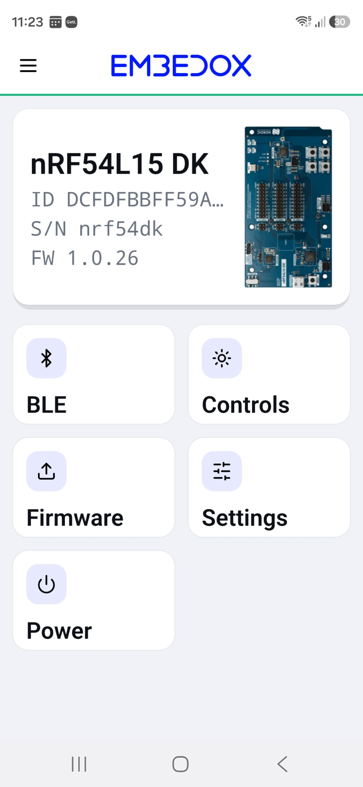
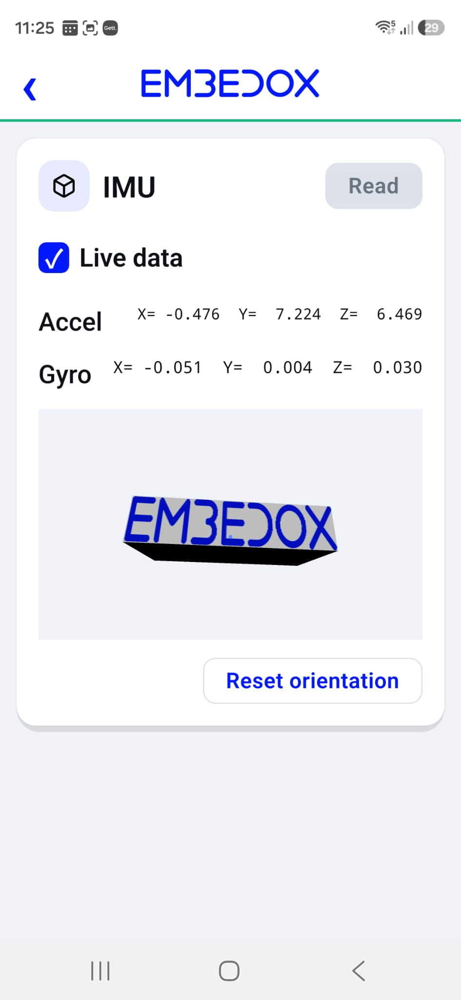
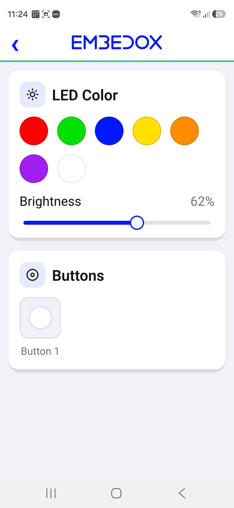
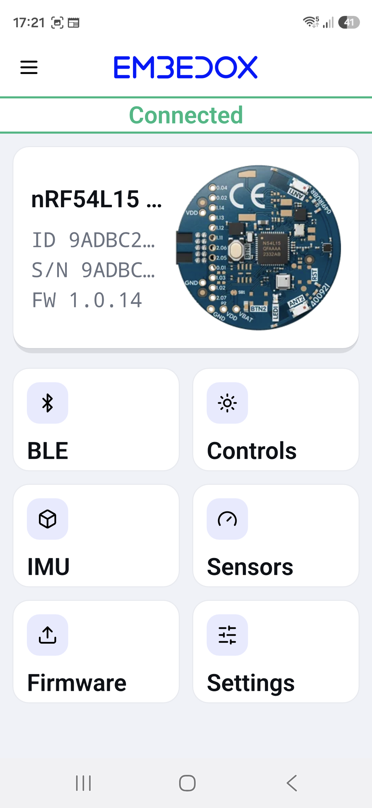
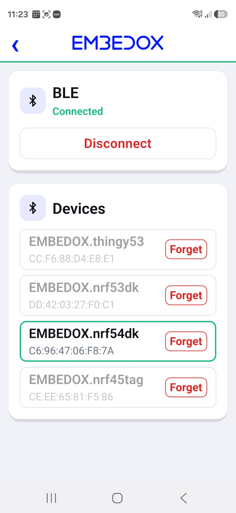
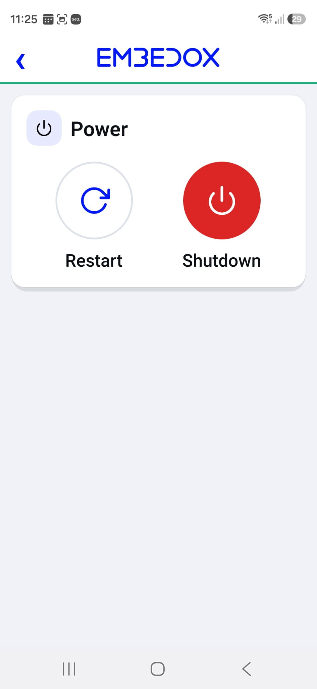
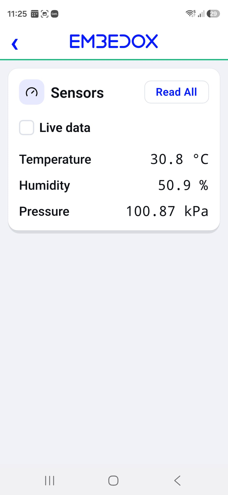
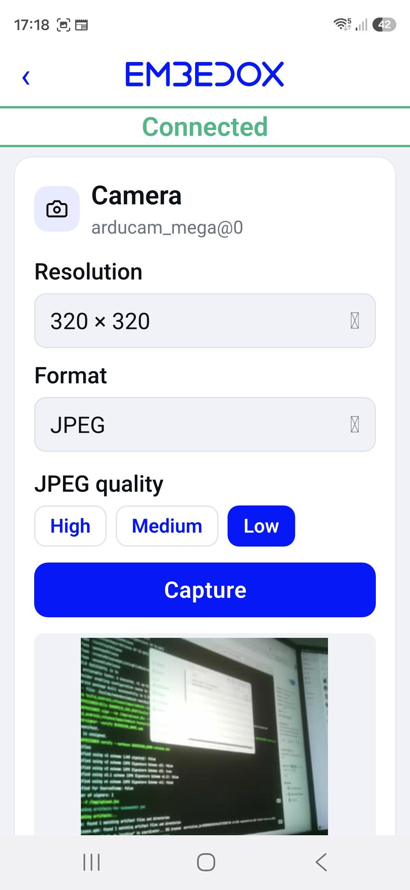
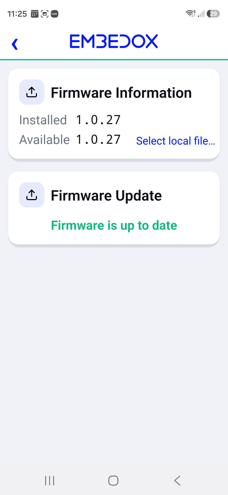
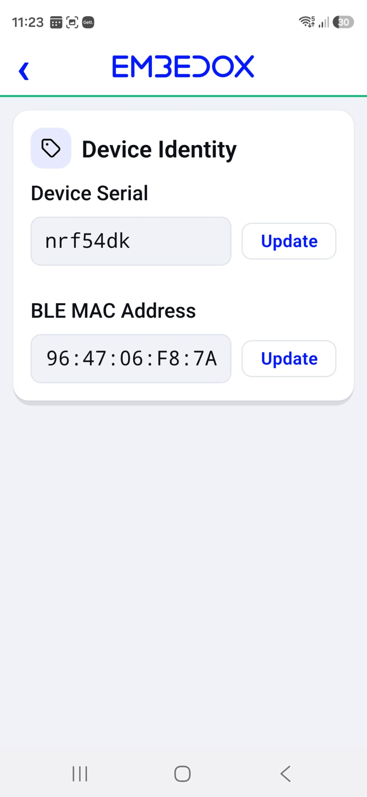

# EMBIoT Toolkit

**EMBEDOX's Bluetooth LE toolkit consists of BLE peripheral firmware for off‑the‑shelf development boards and the application that drives them — environment sensors, IMU, camera, controls, and firmware updates, straight from your phone.**

&nbsp;·&nbsp; [Download the APK directly](apps/android/embiot-toolkit-1.0.57.apk)
&nbsp;·&nbsp; [Download boards firmware](https://github.com/embedox/embiot-toolkit/releases)

---

## What is this?

**EMBIoT Toolkit** is [EMBEDOX](https://www.embedox.com)'s reference Bluetooth LE platform for exploring, testing, and demonstrating embedded devices.

It combines **BLE peripheral firmware** for supported development boards with a **mobile application** for discovering BLE devices, controlling hardware, monitoring sensors, testing peripherals, and performing firmware updates. The peripheral firmware ships for the boards listed below; support for other boards and SoCs is available on request.

**Key features**

- Bluetooth LE discovery and pairing
- LED colour and brightness, live button events, restart and shutdown
- Environment sensors: temperature, humidity, pressure
- Live accelerometer and gyroscope with a 3D view
- Camera image capture (with the camera‑enabled firmware on request)
- Firmware updates over the air (FOTA) from the application
- Provisioning of the device serial and BLE address

 &nbsp;  &nbsp; 

This repository hosts the toolkit's **firmware** (per board, under [Releases](https://github.com/embedox/embiot-toolkit/releases)), its **application**, and the **documentation**. The application itself works fully offline — it never uses the internet, collects no data, and needs no account.

---

## 1. Install the peripheral firmware (First‑Time)

Download your board's peripheral firmware from [Releases](https://github.com/embedox/embiot-toolkit/releases) and follow the **First‑time install** steps on its board page. Each page also lists the release files for that board.

| Board | SoC | Typical capabilities |
|---|---|---|
| [**nRF5340 DK**](docs/boards/nrf5340dk.md) | nRF5340 | BLE · Controls · Power · Camera · Firmware · Settings |
| [**nRF54L15 DK**](docs/boards/nrf54l15dk.md) | nRF54L15 | BLE · Controls · Power · Camera · Firmware · Settings |
| [**nRF54L15 tag**](docs/boards/nrf54l15tag.md) | nRF54L15 | BLE · Controls · Power · IMU · Sensors · Firmware · Settings |
| [**Thingy:53**](docs/boards/thingy53.md) | nRF5340 | BLE · Controls · Power · IMU · Sensors · Firmware · Settings |
| [**ESP32‑S3‑DevKitC**](docs/boards/esp32s3.md) | ESP32‑S3 | BLE · Controls · Power · Firmware · Settings |

> **Camera** — boards marked Camera drive an external camera module. The camera‑enabled firmware and its wiring and setup instructions are not part of the standard release; request them from support@embedox.com.

Once EMBEDOX peripheral firmware is running, every later update (FOTA) is done from the EMBIoT Toolkit application, which carries the current peripheral firmware for every supported board.

---

## 2. Peripheral firmware behaviour

The board runs a state machine; the LED shows which state it is in.

| State | LED | What happens |
|---|---|---|
| Idle | 🟢 green, slow blink | Client devices already paired may connect; a new client device can only pair during a pairing window (next row). After 5 minutes without a connection the board shuts down. |
| BLE pairing | 🔵 blue, fast blink | A 60‑second window opened by the pairing button: the board advertises as `EMBEDOX.<serial>` and any client device may pair. The window closes as soon as a client connects; if none does within 60 seconds the board returns to idle, or to connected when the window was opened to add a second client. |
| BLE connected | 🔵 blue, steady | One or two client devices are connected. No timeout; when the last client disconnects the 5‑minute idle countdown starts again. |
| Error | 🔴 red, steady | Something failed to start. The board shuts down after 45 seconds; wake it to try again. |
| Off | ⚫ off | Shut down: after the idle timeout, after holding the power button for 3 seconds on boards that have one, or from **Power → Shutdown** in the application. See **Waking a board** below. |

**Waking a board.** Press the pairing button once: the board comes back idle, LED blinking 🟢 green. A board without a wake button restarts with its reset button.

---

## 3. The EMBIoT Toolkit application

### Capability‑driven pages

The application does not assume what a board has. On connection the firmware reports its capabilities (camera, number of IMUs, sensor set) and the application builds the Hub from that report. A board with an IMU gets the IMU page, a board with a camera gets the Camera page, and a board without either shows neither. One application therefore serves every supported board.

### Connect

1. **Power the board.** Its LED blinks 🟢 green slowly, which means idle: the board accepts only client devices that have paired with it before. A client device that has never paired will not find it in a scan until the next step.
2. **Press the pairing button** (its location is on the board page). The LED blinks 🔵 blue quickly for 60 seconds: the board now advertises as `EMBEDOX.<serial>` and any client device may pair.
3. Open the **EMBIoT Toolkit** application → **BLE** → **Start Scan** → tap your device.
4. **Enter the pairing passkey when prompted:**

   > ### 🔑 BLE passkey: `000000`
   >
   > On first connection Android shows a **Bluetooth pairing request** — type **`000000`**. Android keeps the bond, so future connections pair automatically. The fixed passkey is an evaluation setting of the reference firmware, not a production security model. **Auto-connect** in the application side menu, on by default, reconnects to any saved device as soon as it is seen advertising.

5. **BLE paired and connected.** Once the passkey is accepted, the LED turns steady 🔵 blue and the application opens the **Hub** page.

The client device is now bonded to the board. Later connections need no button: the board accepts a known client whenever it blinks green. Press the pairing button again only to add another client device (the board serves two at once) or after **Forget** in the application.

---

### Hub

Model, ID, serial, and firmware version of the connected board, with one tile per capability the firmware advertises. The two screenshots show two different boards: same application, different tiles.

 

---

### BLE

Scan for boards, connect and disconnect, and manage saved devices (**Forget** removes the stored pairing). Connections are bonded and encrypted; the passkey is requested once per device.

 

---

### Controls

Pick the RGB LED colour and brightness, or switch each LED on and off on a board whose firmware exposes its LEDs individually (see the board page), and watch **live button‑press events** arrive as the board pushes them — no polling. The colour you set stays until the board changes state.

 

---

### Power

**Restart** or **shut down** the board from the application. A board that was shut down wakes again as described under **Waking a board** above.

 

---

### Sensors

Temperature, humidity, and pressure from the board's environment sensor, read once with **Read All** or refreshed every second with **Live data**.

 

---

### IMU

Live accelerometer and gyroscope data with a real‑time 3D orientation view of the board.

 

---

### Camera

Choose resolution, format, and quality, then capture an image from the attached camera module over BLE. Needs the camera‑enabled firmware, available on request.

 

---

### Firmware

Compare the installed and available firmware versions and run a FOTA update with the image bundled in the application, or with a file chosen through **Select local file…**.

 

---

### Settings

Provisioning of the connected board, stored on the board itself.

- **Device serial** — 4 to 8 letters or digits. It is the suffix of the BLE advertising name: a board with serial `A1B2C3` advertises as `EMBEDOX.A1B2C3`. Out of the box the serial is derived from the SoC's hardware ID.
- **BLE MAC address** — the address the board advertises with, entered as `XX:XX:XX:XX:XX:XX`. It must be a random static address (first octet `C0`–`FF`); `00:00:00:00:00:00` and `FF:FF:FF:FF:FF:FF` are rejected; a value outside that range is stored, but the board keeps its hardware address.

Both take effect after the board reboots (**Power → Restart**).

 

---

## Troubleshooting

- **Pairing fails / wrong passkey** — the passkey is **`000000`**. If it still fails, **Forget** the device in the application, remove it from Android **Settings → Bluetooth**, press the pairing button, then scan and pair again.
- **Device doesn't appear in the scan** — a client device the board does not know yet only sees it while the LED blinks blue: press the pairing button and scan within 60 seconds. Also confirm the board is powered and running EMBEDOX firmware, and that Bluetooth (and, on Android 9–11, Location) is enabled.
- **No Firmware tile on the Hub** — the application only carries peripheral firmware for the boards listed above, and a board it does not recognise shows the BLE tile only. To load a specific image onto a supported board, use **Firmware → Select local file…** with an image received from EMBEDOX.

---

## About EMBEDOX

[**EMBEDOX**](https://www.embedox.com) designs and ships embedded products end to end — silicon bring‑up, Zephyr and embedded Linux, Bluetooth LE and wireless connectivity, device drivers, secure firmware and FOTA, and the cross‑platform applications that go with them. EMBIoT Toolkit is a working sample of that capability.

Building something like this? → **[embedox.com](https://www.embedox.com)**

---

## Links & support

- **Website:** [embedox.com](https://www.embedox.com)
- **EMBIoT Toolkit application privacy policy:** [embedox.com/embiot-privacy](https://www.embedox.com/embiot-privacy)
- **Support:** support@embedox.com
- **Licence:** [LICENSE.md](LICENSE.md) · third-party components: [THIRD_PARTY_NOTICES.md](THIRD_PARTY_NOTICES.md)

---

EMBIoT Toolkit is provided by EMBEDOX Labs Ltd for evaluation and demonstration on supported development boards. © 2026 EMBEDOX Labs Ltd. Nordic, nRF, and Thingy are trademarks of Nordic Semiconductor ASA.
