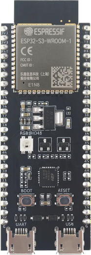

<div align="center">


# ESP32-S3-DevKitC

[Overview](../../README.md) &nbsp;·&nbsp; [Download boards firmware](https://github.com/embedox/embiot-toolkit/releases)

</div>

---

Espressif **ESP32‑S3‑DevKitC**, a low‑cost Wi‑Fi and BLE development board.

| | |
|---|---|
|  | **SoC** ESP32‑S3<br>**Debugger** none needed; built‑in USB with `esptool`<br>**Pairing button** BOOT<br>**Power button** none; use **Power → Shutdown** in the application<br>**First‑time install** `esptool`, one `.bin` file at `0x0`<br>**Release files** `peripheral-esp32s3-<ver>.bin` |

## Capabilities in EMBIoT Toolkit

| BLE | Controls | Power | IMU | Sensors | Camera | Firmware | Settings |
|:---:|:---:|:---:|:---:|:---:|:---:|:---:|:---:|
| ✓ | ✓ | ✓ | — | — | — | ✓ | ✓ |

## First‑time install

1. Download `peripheral-esp32s3-<ver>.bin` from [Releases](https://github.com/embedox/embiot-toolkit/releases) and install [`esptool`](https://docs.espressif.com/projects/esptool/) (`pip install esptool`).
2. Connect the board's connector labelled **USB** (not **UART**). Hold **BOOT** and tap **RESET** if it does not enter download mode by itself.
3. Write the image at `0x0`:

   ```bash
   esptool --chip esp32s3 --port <PORT> --baud 921600 write_flash 0x0 peripheral-esp32s3-<ver>.bin
   ```
4. Press **RESET** once the write has finished; over the USB connector the tool's own reset does not always reach the chip. Done when the LED blinks green slowly. Continue with **Connect** in the [README](../../README.md#connect): press the pairing button and pair the client device.

## Release files

| File | Contains | Goes in with |
|---|---|---|
| `peripheral-esp32s3-<ver>.bin` | MCUboot + application image, complete flash image | `esptool`, offset `0x0` |

All files are under [Releases](https://github.com/embedox/embiot-toolkit/releases) with a `SHA256SUMS.txt`.

## Board notes

- Press **BOOT** to open a 60‑second pairing window. There is no power or wake button: **RESET** restarts the board, and shutdown is available from the application's **Power** page.
- No `.hex` for this board: the ESP32 is flashed with `.bin` images at fixed offsets, and the release image already contains the bootloader.
