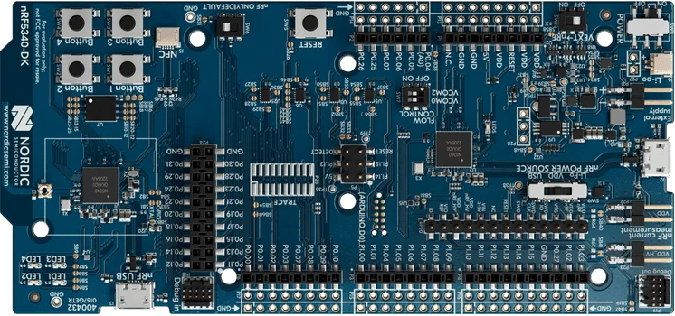

<div align="center">


# nRF5340 DK

[Overview](../../README.md) &nbsp;·&nbsp; [Download boards firmware](https://github.com/embedox/embiot-toolkit/releases)

</div>

---

Nordic **nRF5340** development kit.

| | |
|---|---|
|  | **SoC** nRF5340, application and network core<br>**Debugger** on‑board SEGGER J‑Link (debug USB port)<br>**Pairing button** Button 2<br>**Power button** Button 1<br>**First‑time install** J‑Link, two `.hex` files<br>**Release files** `peripheral-nrf5340dk-<ver>.hex` · `peripheral-nrf5340dk-<ver>-net.hex` |

## Capabilities in EMBIoT Toolkit

| BLE | Controls | Power | IMU | Sensors | Camera | Firmware | Settings |
|:---:|:---:|:---:|:---:|:---:|:---:|:---:|:---:|
| ✓ | ✓ | ✓ | — | — | on request | ✓ | ✓ |

**Camera** needs an external camera module and the camera‑enabled firmware, which is not part of the standard release. Request it, together with the wiring and setup instructions, from support@embedox.com.

## First‑time install

1. Download `peripheral-nrf5340dk-<ver>.hex` and `peripheral-nrf5340dk-<ver>-net.hex` from [Releases](https://github.com/embedox/embiot-toolkit/releases).
2. Connect the DK's debug USB port (the on‑board J‑Link).
3. **nRF Connect for Desktop → Programmer:** **Add file** both `.hex` files → **Erase all & write**. The Programmer places each file on its core by address.

   Or from the command line:

   ```bash
   nrfutil device program --firmware peripheral-nrf5340dk-<ver>-net.hex --core network --options chip_erase_mode=ERASE_ALL
   nrfutil device program --firmware peripheral-nrf5340dk-<ver>.hex --core application --options chip_erase_mode=ERASE_ALL,reset=RESET_SYSTEM
   ```
4. Done when the LED blinks green slowly. Continue with **Connect** in the [README](../../README.md#connect): press the pairing button and pair the client device.

## Release files

| File | Contains | Goes in with |
|---|---|---|
| `peripheral-nrf5340dk-<ver>.hex` | MCUboot + application image | application core, J‑Link |
| `peripheral-nrf5340dk-<ver>-net.hex` | network core (ipc_radio) | network core, J‑Link |

All files are under [Releases](https://github.com/embedox/embiot-toolkit/releases) with a `SHA256SUMS.txt`.

## Board notes

- No RGB LED: **LED1**, **LED2** and **LED3** are dimmed as the red, green and blue channels of one LED. **LED1** shows the 🔴 red error state, **LED2** the 🟢 green states and **LED3** the 🔵 blue ones; a colour picked on the **Controls** page lights the three together.
- Press **Button 2** to open a 60‑second pairing window; it also wakes the board after a shutdown. Hold **Button 1** for 3 seconds to shut the board down.
- The nRF5340 has two cores. FOTA updates the application core; when a release ships a new `-net.hex`, flash it with the J‑Link.
