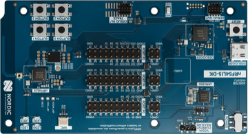

<div align="center">


# nRF54L15 DK

[Overview](../../README.md) &nbsp;·&nbsp; [Download boards firmware](https://github.com/embedox/embiot-toolkit/releases)

</div>

---

Nordic **nRF54L15** development kit.

| | |
|---|---|
|  | **SoC** nRF54L15<br>**Debugger** on‑board SEGGER J‑Link (debug USB port)<br>**Pairing button** Button 1<br>**Power button** Button 0<br>**First‑time install** J‑Link, one `.hex` file<br>**Release files** `peripheral-nrf54l15dk-<ver>.hex` |

## Capabilities in EMBIoT Toolkit

| BLE | Controls | Power | IMU | Sensors | Camera | Firmware | Settings |
|:---:|:---:|:---:|:---:|:---:|:---:|:---:|:---:|
| ✓ | ✓ | ✓ | — | — | on request | ✓ | ✓ |

**Camera** needs an external camera module and the camera‑enabled firmware, which is not part of the standard release. Request it, together with the wiring and setup instructions, from support@embedox.com.

## First‑time install

1. Download `peripheral-nrf54l15dk-<ver>.hex` from [Releases](https://github.com/embedox/embiot-toolkit/releases).
2. Connect the DK's debug USB port (the on‑board J‑Link).
3. **nRF Connect for Desktop → Programmer:** **Add file** `peripheral-nrf54l15dk-<ver>.hex` → **Erase all & write**. Or copy the file onto the `JLINK` USB drive the DK mounts.

   Or from the command line:

   ```bash
   nrfutil device program --firmware peripheral-nrf54l15dk-<ver>.hex --options chip_erase_mode=ERASE_ALL,reset=RESET_SYSTEM
   ```
4. Done when the LED blinks green slowly. Continue with **Connect** in the [README](../../README.md#connect): press the pairing button and pair the client device.

## Release files

| File | Contains | Goes in with |
|---|---|---|
| `peripheral-nrf54l15dk-<ver>.hex` | MCUboot + application image | J‑Link |

All files are under [Releases](https://github.com/embedox/embiot-toolkit/releases) with a `SHA256SUMS.txt`.

## Board notes

- No RGB LED: **LED0**, **LED1** and **LED2** are the red, green and blue channels, each simply on or off. **LED0** shows the 🔴 red error state, **LED1** the 🟢 green states and **LED2** the 🔵 blue ones. The **Controls** page therefore shows three on/off switches, one per LED, instead of the colour picker and brightness slider.
- Press **Button 1** to open a 60‑second pairing window; it also wakes the board after a shutdown. Hold **Button 0** for 3 seconds to shut the board down.
