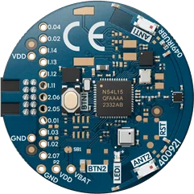

<div align="center">


# nRF54L15 tag

[Overview](../../README.md) &nbsp;·&nbsp; [Download boards firmware](https://github.com/embedox/embiot-toolkit/releases)

</div>

---

A compact **nRF54L15** tag‑format board with an IMU and an environment sensor.

| | |
|---|---|
|  | **SoC** nRF54L15<br>**Debugger** none on board; external SEGGER J‑Link on the SWD header<br>**Pairing button** push button on top<br>**Power button** none; use **Power → Shutdown** in the application<br>**First‑time install** external J‑Link, one `.hex` file<br>**Release files** `peripheral-nrf54l15tag-<ver>.hex` |

## Capabilities in EMBIoT Toolkit

| BLE | Controls | Power | IMU | Sensors | Camera | Firmware | Settings |
|:---:|:---:|:---:|:---:|:---:|:---:|:---:|:---:|
| ✓ | ✓ | ✓ | ✓ | ✓ | — | ✓ | ✓ |

## First‑time install

1. Download `peripheral-nrf54l15tag-<ver>.hex` from [Releases](https://github.com/embedox/embiot-toolkit/releases).
2. Attach an external SEGGER J‑Link to the SWD/debug header and power the tag.
3. **nRF Connect for Desktop → Programmer:** select the J‑Link → **Add file** `peripheral-nrf54l15tag-<ver>.hex` → **Erase all & write**.

   Or from the command line:

   ```bash
   nrfutil device program --firmware peripheral-nrf54l15tag-<ver>.hex --options chip_erase_mode=ERASE_ALL,reset=RESET_SYSTEM
   ```
4. Done when the LED blinks green slowly. Continue with **Connect** in the [README](../../README.md#connect): press the pairing button and pair the client device.

## Release files

| File | Contains | Goes in with |
|---|---|---|
| `peripheral-nrf54l15tag-<ver>.hex` | MCUboot + application image | J‑Link |

All files are under [Releases](https://github.com/embedox/embiot-toolkit/releases) with a `SHA256SUMS.txt`.

## Board notes

- Press the push button on top to open a 60‑second pairing window; it also wakes the tag after a shutdown. There is no power button: shut down from the application's **Power** page, or let the 5‑minute idle timeout do it.
- There is no on‑board debugger, so the first install and any recovery need the external J‑Link. Every later version goes in over the air.
- The RGB LED is on/off per channel. **Controls** shows the usual colour picker, but only red, green, blue, yellow and white come out (orange lands on yellow, purple on white), and the brightness slider only switches the LED off at 0%.
