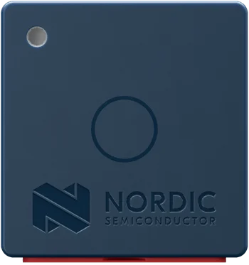

<div align="center">


# Thingy:53

[Overview](../../README.md) &nbsp;·&nbsp; [Download boards firmware](https://github.com/embedox/embiot-toolkit/releases)

</div>

---

Nordic **Thingy:53**, a battery‑powered nRF5340 prototyping platform with an IMU and environment sensors.

| | |
|---|---|
|  | **SoC** nRF5340, application and network core<br>**Debugger** none on board; external SEGGER J‑Link on the 10‑pin SWD connector<br>**Pairing button** push button on top<br>**Power button** none; use **Power → Shutdown** in the application<br>**First‑time install** external J‑Link, two `.hex` files<br>**Release files** `peripheral-thingy53-<ver>.hex` · `peripheral-thingy53-<ver>-net.hex` |

## Capabilities in EMBIoT Toolkit

| BLE | Controls | Power | IMU | Sensors | Camera | Firmware | Settings |
|:---:|:---:|:---:|:---:|:---:|:---:|:---:|:---:|
| ✓ | ✓ | ✓ | ✓ | ✓ | — | ✓ | ✓ |

## First‑time install

1. Download `peripheral-thingy53-<ver>.hex` and `peripheral-thingy53-<ver>-net.hex` from [Releases](https://github.com/embedox/embiot-toolkit/releases).
2. Attach an external SEGGER J‑Link (or an nRF DK's **Debug out** port) to the 10‑pin SWD debug connector and switch the Thingy on.
3. **nRF Connect for Desktop → Programmer:** select the J‑Link → **Add file** both `.hex` files → **Erase all & write**. The Programmer places each file on its core by address.

   Or from the command line:

   ```bash
   nrfutil device program --firmware peripheral-thingy53-<ver>-net.hex --core network --options chip_erase_mode=ERASE_ALL
   nrfutil device program --firmware peripheral-thingy53-<ver>.hex --core application --options chip_erase_mode=ERASE_ALL,reset=RESET_SYSTEM
   ```
4. Done when the LED blinks green slowly. Continue with **Connect** in the [README](../../README.md#connect): press the pairing button and pair the client device.

## Release files

| File | Contains | Goes in with |
|---|---|---|
| `peripheral-thingy53-<ver>.hex` | MCUboot + application image | application core, J‑Link |
| `peripheral-thingy53-<ver>-net.hex` | network core (b0n + ipc_radio) | network core, J‑Link |

All files are under [Releases](https://github.com/embedox/embiot-toolkit/releases) with a `SHA256SUMS.txt`.

## Board notes

- Press the push button on top to open a 60‑second pairing window; it also wakes the Thingy after a shutdown. There is no power button: shut down from the application's **Power** page, or let the 5‑minute idle timeout do it.
- The factory USB bootloader cannot install EMBEDOX‑signed images, and the EMBEDOX image has no USB recovery mode, so a debugger is required for the first install and for recovery.
- The nRF5340 has two cores. FOTA updates the application core; when a release ships a new `-net.hex`, flash it with the J‑Link.
